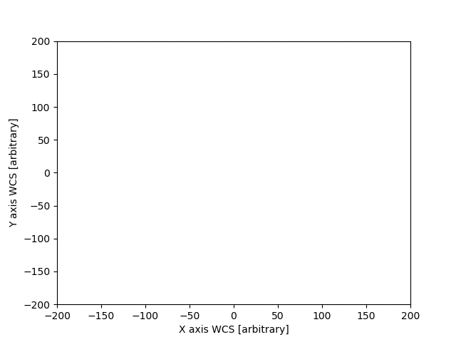

# Visual-Odometry-Cpp
Visual Odometry pipeline implementation in C++

I am a former physicist working as a software engineer in topics like sensor data fusion. I have a strong interest in computer vision and always wondered how things like feature tracking magically work in some open-source projects. 
After taking part in the coursera course Robotics:Perception, I decided to just try it out myself and learn :) 

# The task

It would be rather straightforward to use opencv and just connect the provided functionality to some kind of visual odometry pipeline. What I rather try to do:

- Creating a visual odometry pipeline from scratch (see below) extracting poses from monocular camera images
- Implementing all major algorithms (like feature detection, description,..) myself
- Using only utility functions and structs from opencv. For me also things like SVD count as such.
- Having fun, so please pardon the lack of testing and documentation. I do enough of this at work.
- ....... And finally hop on the open-source train ;) 

The goal is not to create yet another visual odometry pipeline that can easily be used by everyone. There exist multiple sophisticated open-source projects for this. But maybe this project helps someone understanding visual odometry. 

# Current functionality

So far the goal is to get the whole pipeline running, so no focus on quality at all! 
The most basic kind of algorithms are in use at the moment.
With respect to feature detection, description and matching the following functionality is provided:
- Harris edge detector
- BRIEF descriptor
- Brute force matcher

Additionally, fundamental matrix estimation and essential matrix decomposition is implemented. 
Having this functionality at least some (low quality) delta poses can be computed. 

A python package can be built optionally that exposes the Master interface.

Finally there is some output, looks horrible, but at least its some kind of result =)

# Usage

Using the application runKittiDemo.exe in apps/ it is possible to visualize matched features in an camera image stream.
This app is currently hard coded to KITTI image sequence 0:

`runKittiDemo.exe <path-to-camera-images> e.g. runKittiDemo.exe ./test/*.jpg` 

Additionally there is a python script for running the KITTI sequence + comparing it to the ground truth

`python runKittiDemp.py -i <camera-images-dir> -r <ground_truth_textfile> ` 

# Dependencies

The following dependencies are placed in the folder 3rdparty and included as source:

- [gtest](https://github.com/google/googletest/blob/master/googletest/LICENSE)

The following dependencies are required as CMake package:

- [opencv](https://opencv.org/license/)
- swig (optionally for python package)
- python (optionally for python package)
